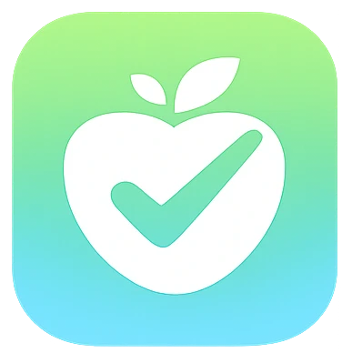

<p align="center">
  
</p>

<h1 align="center">🥗 Intake API</h1>

<p align="center">
  <strong>Track food, not numbers.</strong><br />
  Backend API for an AI-powered food diary focused on simplicity, daily use, and long-term clarity.
</p>

<p align="center">
  
  
  
  
</p>

---

## 📌 Overview

**Intake API** is the backend service for **Intake** — a minimalist, AI-powered food diary.

The idea is intentionally simple:

> _You describe what you ate — the system does the rest._

Users log food using natural language.  
The backend parses the input with AI, validates it, stores results by day, and exposes a clean, predictable API for tracking and statistics.

This repository contains **only the backend API**.  
Frontend lives here 👉 https://github.com/bohdan-strilets/Intake-web

---

## 🎯 Project Status

- ✅ MVP completed
- 🧪 Pet project
- 💼 Portfolio-ready
- 🔒 API contracts frozen

The backend is considered **stable**.  
Future work is expected mostly on the frontend and UX.

---

## 🧠 Core Principles

- Backend is the single source of truth
- No calorie or macro calculations on frontend
- Derived data is never persisted
- Explicit, readable, predictable code
- Minimal API surface
- No premature optimizations

---

## 🧠 Design Decisions

### Backend as the source of truth

All calculations are handled on the backend.
The frontend only renders validated data.

### Derived data is never persisted

Statistics are always calculated from daily records.
This keeps the data model simple and consistent.

### Day as an aggregate root

A Day represents a single daily aggregate.
Food entries are atomic and always belong to a Day.

### AI behind a strict boundary

AI output is never trusted directly.
All responses are validated before persistence.

### Minimal API surface

Only endpoints required for daily usage are exposed.
No speculative or “just in case” features.

### No food catalogs or barcodes

The product avoids branded databases and barcode scanning.
Focus is on awareness, not nutritional micromanagement.

### Readability over abstraction

Explicit code is preferred over clever patterns.
Long-term maintainability is the priority.

---

## 🧱 Architecture

### Tech Stack

- **Framework:** NestJS
- **Language:** TypeScript (strict)
- **Database:** MongoDB (Mongoose)
- **Auth:** JWT + Refresh Tokens
- **AI:** OpenAI (structured JSON output)
- **Validation:** class-validator + Zod
- **Docs:** Swagger (OpenAPI)

---

## 📂 Main Modules

- **Auth** — registration, login, refresh, logout
- **Users** — profile & body parameters
- **Days** — calendar & daily totals
- **Food** — add/delete food entries
- **AI** — parse food descriptions (JSON-only)
- **Stats** — derived statistics (read-only)

---

## 🚀 Getting Started

### Prerequisites

- Node.js ≥ 18
- MongoDB (local or Atlas)

### Install

```bash
npm install
```

### Development

```bash
npm run start:dev
```

### Production

```bash
npm run start:prod
```

---

## 🔗 Related

Frontend (Web):  
https://github.com/bohdan-strilets/Intake-web

---

## 📄 License

MIT License

---

## ✍️ Author

**Bohdan Strilets**  
Software engineer

Portfolio project — **Intake**
